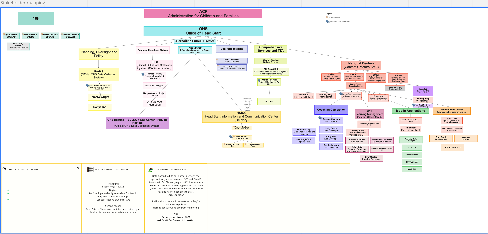
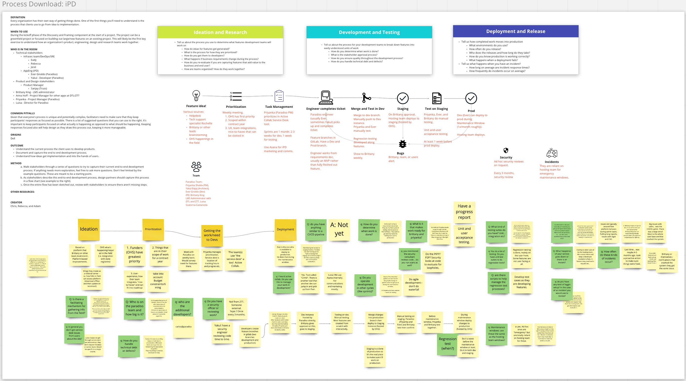

# Research plan - Task 1

This research plan uses the [18F research plan template](https://github.com/18F/ux-guide/blob/master/_pages/resources/research-plan.md).

## Background

The Office of Head Start (OHS) owns and operates a set of IT infrastructure that is being used for multiple purposes, one of which is the system called the Early Childhood Learning Knowledge Center (ECLKC). ECLKC hosts multiple applications, including the ECLKC website as well as some companion apps.

OHS has brought in TRUSS to help them both operate the hosting infrastructure and improve both software and processes as it relates to the hosting infrastructure and related teams.

These are the goals for this project as defined by OHS:

*  **1.0**	The management and configuration of cloud hosting tools such as Infrastructure-as-a-Service providers and Platform-as-a-Service providers.
* **2.0**	Design and implementation of DevOps tools and practices such as deployment pipelines and continuous integration.
* **3.0**	Consultation with product teams on infrastructure-related tasks, and with OHS leadership on technical strategies.
* **4.0**	The management and configuration of shared services such as central authentication tools and internal data APIs.

The ECLKC hosting infrastructure is hosted in AWS and serves the following applications/teams:

* ECLKC
* HSICC
* National Centers
  * iPD Learning Management System (includes iLookOut)
  * Coaching Companion
  * Early Educator Central
  * Mobile Applications
    * ELOF 2 Go
    * ELOF 2 Go Spanish
    * ELOF@Home
    * Head Start Talks
    * Ready-DLL
    * Head Start Resources

We believe there are modificiations to technology and practice that can allow for self-service of the application deployments while maintaining ATO.

This is also our pilot to see if we can define practice and standards for technical teams working with OHS outside of the ECLKC infrastructure.

## Goals

The initial phase of our research is both [Foundational and Generative](https://ux-guide.18f.gov/research/clarify-the-basics/#research-types).

Therefore, we have the following goals for this phase:

* Identify and evaluate current processes for development workflows
* Determine developers' painpoints for doing their work
* Determine stakeholders' strategic priorities
* Determine current application needs regarding development and deployment
* Describe what success looks like for the interviewee

## Research questions

These questions we intend to answer via a number of workshops and interviews. They are separated here by the venue in which they will be asked.

### Stakeholder mapping
(complete)

1. Can you introduce yourself?
1. What’s your role at OHS?
1. How long have you been at OHS? 
    * In this role?
1. Who do you have to report to or give updates to?

[View an up to date version of this exercise on Miro](https://miro.com/app/board/o9J_lCdf5Iw=/?moveToWidget=3074457359393677819&cot=14)

### Tooling Survey
(complete)

1. Do you or your team have preferred tools for the following tasks?
    * Project/Task tracking
    * Version control
    * Continuous integration
    * Automated testing
    * Documentation
    * Environment configuration and secrets
    * Monitoring and alerting

[View an up to date version of this survey on Google Sheets](https://docs.google.com/spreadsheets/d/1PK7PY9JJKgAEAyE1UmTiBADxf7iQYt7IdrqHpmSSpNk/edit?resourcekey#gid=1978168714)

### Process Download

#### Deployment and Process

1. What is your current deployment process?
    * What tools do you use to perform this process?
1. Who is responsible for deployments/releases?
1. Are deployments separate from releases?
    * If so, how?
1. What is the deployment frequency? How often do you deploy? 
1. How long does it take to deploy?
1. What version control system do you use?
1. What is the review process like for work? 
1. What is your definition of done? What do you think is your team’s definition of done?

#### Tooling

1. Do you or your team have preferred tools for the following tasks?
    * Project/Task tracking
    * Version control
    * Continuous integration
    * Cloud Hosting
    * Deployment

#### Security and Observability

1. What metrics do you care about?
1. What metrics does your team monitor, if any?
    * How have you been monitoring these metrics?
    * How frequently do you monitor these metrics?
    * Why do you monitor these metrics?
1. What happens if the service goes down?
    * How do you know?
    * What does incident response look like?
1. Are there security reviews of work?
    * Who participates in security assessments?
1. How do you get meaningful signal about your service’s performance?

#### Testing

1. How would you describe your testing philosophy?
1. What type of testing suite do you have? 
    * Unit, integration, end to end tests?
    * What tests are automated?
    * When do they run?
    * Are they in CI/CD pipeline?
1. What does your local development experience look like?

**The iPD team Process Download** 

[View an up to date version of the iPD team's Process Download](https://miro.com/app/board/o9J_lCdf5Iw=/?moveToWidget=3074457359402237081&cot=14)

[View an up to date version of the Coaching Companion team's Process Download](https://miro.com/app/board/o9J_lCdf5Iw=/?moveToWidget=3074457359402237092&cot=14)

[View an up to date version of the HSICC team's Process Download](https://miro.com/app/board/o9J_lCdf5Iw=/?moveToWidget=3074457359402237070&cot=14)

### System Mapping

1. Please describe your architecture.
1. Please describe the authentication flow of your users.
    * Follow up: Are there different types of users in your system?
    * Is their auth flow different?
1. Are there repeating jobs your system relies on (e.g. cron data sync)?
1. Are there any APIs or export processes for sharing data with other systems or people?

[View the inherited system map on Miro](https://miro.com/app/board/o9J_lCdf5Iw=/?moveToWidget=3074457360147104894&cot=14)

### User interviews

#### Intro

Thank you for joining us today. My name is XXX and I’m an XXX [add your name and position] for Truss Works. We’re contracting with OHS to help manage and configure infrastructure for the apps under the OHS umbrella, support automation where possible, and to engender an internal devsecops community of practice--essentially, building security, infrastructure, and operations concerns into your apps as part of development. We wanted to have a conversation with you today to better understand your role, the challenges you face, and your experiences with current tools, as well as your day-to-day work. The information you provide will inform what we may build.

Before we begin, I’d like to take a moment for the rest of my team to quickly introduce themselves… [beach ball to each other: name, role @Truss, and why you’re here (taking notes, etc.)]

With your approval, we would like to record this session for research purposes.

[If they say no] Ok, no problem. Since you’re not comfortable being recorded, can we please take notes during this session so that we have a log of our conversation? [Team switches to recording direct quotes of interest rather than implicit observations]

Before we begin, I want to make sure you know to speak openly and honestly: we are interested in your personal perspective so do not worry about representing the opinions of anyone else. If you would like to say something off the record, please let us know and we will stop the recording. Also, if there are any questions you do not know or cannot answer, that is perfectly fine.

Any questions? Let’s begin! [start recording]
#### Opening Questions

1. How did you start your workday today?
1. Walk me through your day yesterday.

#### Leadership Strategy

1. Any strategic objectives affecting your project right now that we should be aware of?
1. Can you articulate the problem that you think this project is trying to solve?

#### Collaboration

1. Does your team collaborate with any other team currently?
    * If so, who do you collaborate with and how?
    * If so, what are some of the biggest challenges to effective collaboration?
1. How do you collaborate with SREs/DevOps/Infrastructure practitioners?

#### Data

1. What kinds of data do you store?
    * Follow up: Is any of this data media content submitted by end users?
1. What user data do you manage, if any?
    * Is any of this data PII?
1. How much standardization is there with user submitted data?
1. What happens if you lose data? Do you know when you have inconsistent data?

#### Testing

1. What is the current cadence of integration tests? 
    * Why is it this cadence?
1. What is your lead time? (What is the average amount of time it takes from the time code is checked into the version control system to the point in time where it is deployed to staging and production?)
#### Security and Observability

1. What is your logging set up?
1. What external services does your app use?

#### Deployment and Process

1. What would a healthy deployment cycle timeline look like, in your point of view?
1. What kind of downtime is acceptable for your service/app?
#### Tooling

1. Do you or your team have preferred tools for the following tasks?
    * Continuous integration
    * Cloud Hosting
    * Deployment
    * Communication - Async or sync
    * Authentication
    * Logging
1. Are there tools you would hate to use? Why?
1. What do you wish you had in terms of tooling that you don’t currently?
1. What’s easy for you about your job?
1. What is the most difficult thing about doing your job well?
    * IF they mention anything about manual work:
      * What’s the most painful manual process for you?
      * Are there repeating manual tasks that bother you as well?
1. What would you be upset about losing if it disappeared tomorrow (that’s job related)?
1. Are there any constraints that aren’t captured in the questions we’ve asked you?

#### Final Thoughts

1. What keeps you up at night?
1. If I had a magic wand and granted you one wish to make your job easier, what would you wish for and why?
1. Is there anything you wish we asked about?
1. Is there anything we’ve missed?
1. Who else should we speak to?
1. Would you be interested in someone from our team embedding with yours for a few days?
1. Would you be interested in coming to demos of work we’ve completed?

## Method(s)

We have already conducted the [stakeholder mapping excercise](https://miro.com/app/board/o9J_lCdf5Iw=/?moveToWidget=3074457359393677819&cot=14)).

We will be completing a Process download workshop with the HSICC team, the Coaching Companion team, and the iPD team. [An example of that workshop is available](https://miro.com/app/board/o9J_lCdf5Iw=/?moveToWidget=3074457359402237068&cot=14). We'll update this plan with links to the workshops as they are completed.

We will be completing the System Mapping exercise with each of these 3 teams. We'll update this plan with links to the exercises as they are completed.

We will then conduct a series of single-subject user interviews. We will use a subset of the questions detailed above as appropriate to the interviewee.

## Research roles

> **Instructions:** Consider how research can be [a team activity](https://ux-guide.18f.gov/research/clarify-the-basics/#a-team-activity) and decide who will hold specific [research roles](https://ux-guide.18f.gov/research/do/#clarify-team-roles).

* Research lead
* Moderator
* Notetaker(s)
* Observer(s)

Given the size of our team, we'll likely have no observers in favor of keeping someone in a notetaker role. 

## Timeline

> **Instructions:** Document the estimated [timeline](https://ux-guide.18f.gov/research/plan/#timeline) for completing this research. Plan more time than you think you need.

| Syntax      | Description |
| ----------- | ----------- |
| Study design      |  1 week |
| Recruiting   |  3 days |
| Process Download Sessions | 2 weeks |
| System Mapping Sessions | 2 weeks |
| User Interview Design | 1 week |
| User Interviews | 2 weeks |
| Top-line synthesis   |  4 days |
| Collaborative analysis   |  3 days |
| Collaborative synthesis   |  3 days |
| Summary/outputs   |  3 days |

## Participants and recruiting

We expect to work closely with members of the HSICC team, Coaching Companion, iPD team. With the last team we'll specifically be focusing on issues around the shared Central Authentication Service (CAS). Alana Buroff, Information Systems and Communications Team lead, completed a stakeholder exercise and identified who we should speak to for the first round. She will be sending the introduction emails to stakeholder/users targeted in this user research plan. We will then follow up with the teams.

## Ethics considerations

With their knowledge and consent, we will be recording all these conversations via Zoom and sharing them with our partners at OHS and 18F. 

## Expected outputs and outcomes

### Outputs

At the end of this research round, we should have:
 * a stakeholder map,
 * multiple process download diagrams,
 * basic architecture diagrams, at least the HSICC team,
 * user research synthesis,
 * list of problems/needs to prioritize in product roadmap including those from the different product teams, and
 * a completed bang for your buck exercise to guide the creation of an actual roadmap.

We may also have:
 * a deployment ridealong diagram and
 * a system attribute prioritization diagram.

### Outcomes

* Hosting team is able to work on prioritized work to address product teams' needs while aligning with project goals
* Hosting team has identified needs for follow up research if any and is able to construct plan
* Hosting team is able to construct research plan for all of OHS hosting needs 
